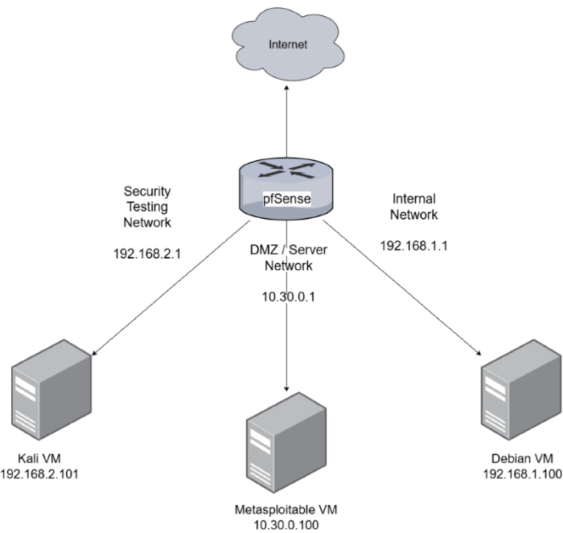
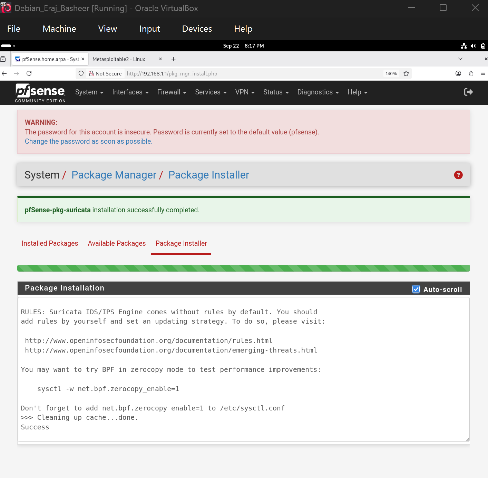
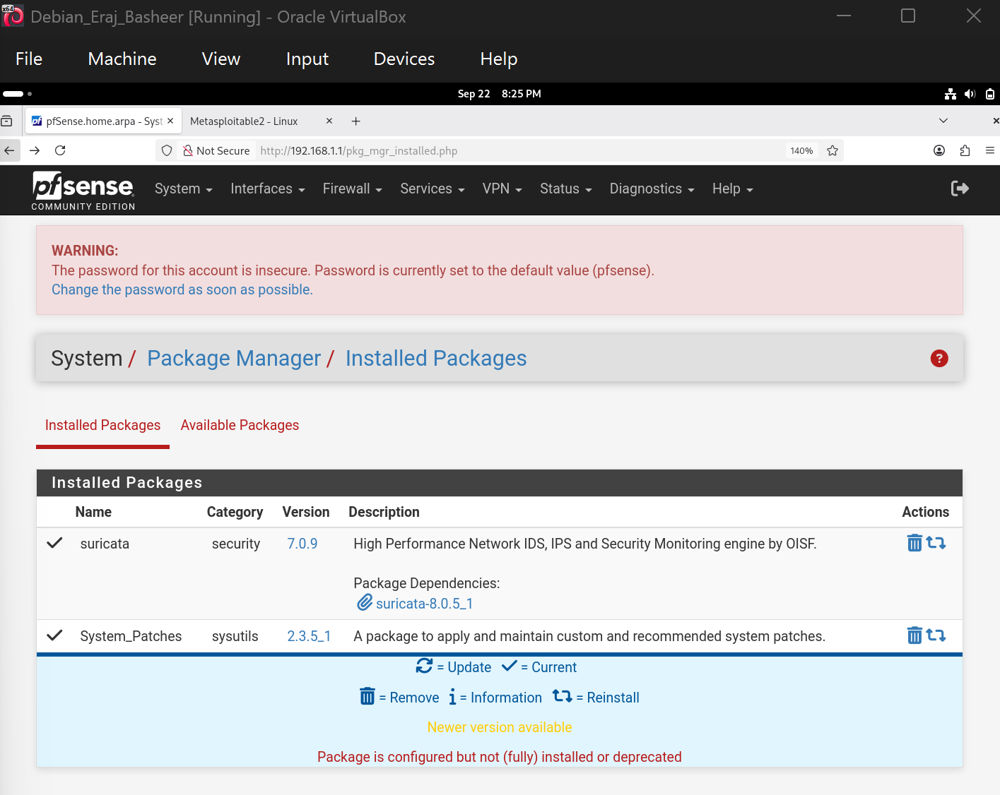
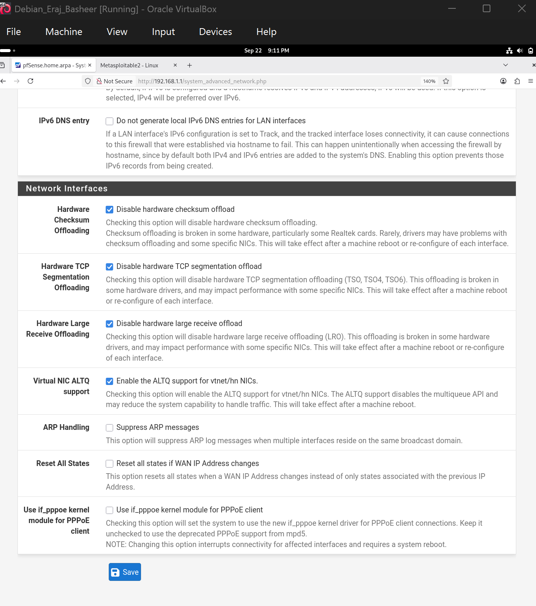
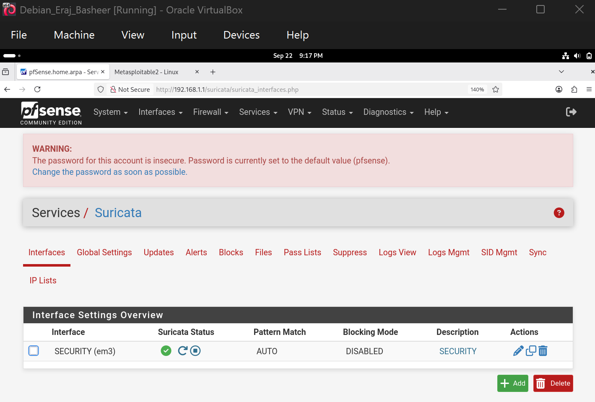
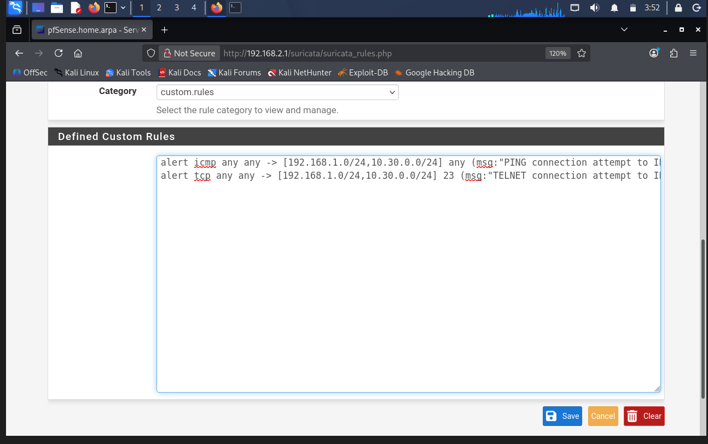
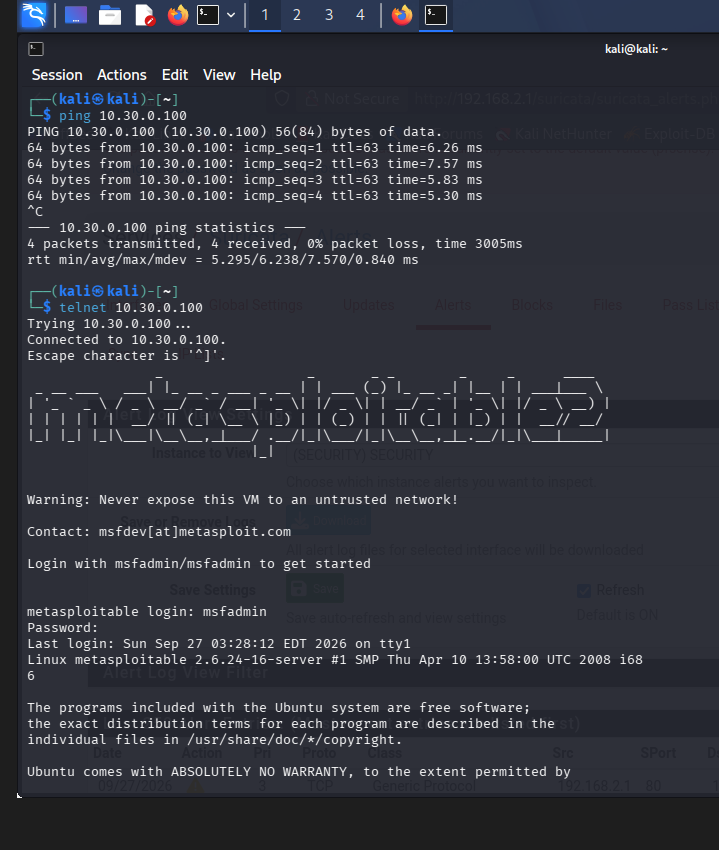
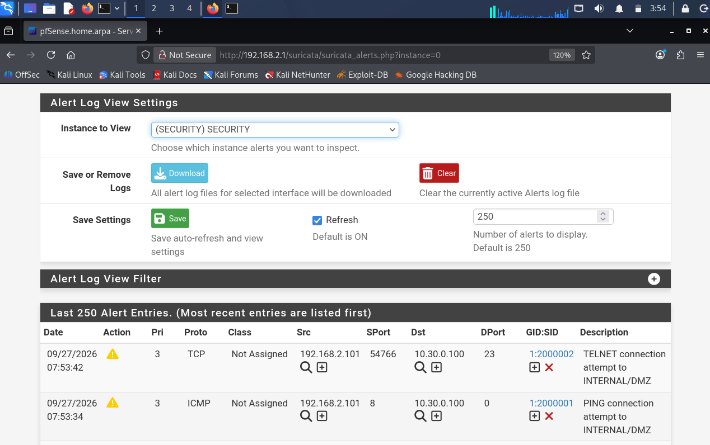

# Suricata IDS/IPS

## Overview

This lab involved installing and configuring Suricata as an IDS/IPS on pfSense.

The Suricata configuration was used to monitor traffic on the SECURITY interface and detect specific network activity using custom rules.

The lab builds off of the network configuration from my [pfSense Firewall Project](https://github.com/eraj-basheer/pfSense-Firewal).

## Objectives

* Install Suricata package on pfSense
* Configure Suricata on the SECURITY interface
* Disable hardware offloading required for Suricata
* Create custom Suricata rules
* Generate test traffic from Kali
* Review Suricata alerts


## Lab Environment

| Component | Purpose |
|---|---|
| pfSense | Firewall/Router |
| Debian | Internal Corporate Network Client |
| Metasploitable | DMZ Client |
| Kali Linux | Security Testing/Attacker Machine |


## Network Configuration

| Network | Subnet |
|---|---|
| WAN | DHCP |
| Internal Network | 192.168.1.0/24 |
| DMZ Network | 10.30.0.0/24 | 
| Security Testing Network | 192.168.2.0/24 | 

### Network Diagram



### pfSense Configuration


## Installing Suricata

After logging into the pfSense WebConfigurator, open the Package Manager page under the System drop down menu. Following this, select Available Packages and search for and download Suricata. Below is the successful installation.

 <br>


## Configure Suricata

First, hardware checksum offloading needs to be disabled. After clicking on System and then Advanced, go to Networking the
tab. Ensure disable hardware checksum offloading is selected. Save changes and then reboot pfSense. This step ensures accurate packet inspection and alert generation. 
<br>




## Configure SECURITY Monitoring

In our current lab scenario, we want to monitor traffic sent from the Kali VM (Security Testing
machine) to the Metasploitable VM (DMZ server). In order to do this, we have to enable Suricata on the SECURITY interface. On the pfSense menu, click on Services and select Suricata. Select Interfaces and then select Add. Click on the Enable checkbox and set Interface to SECURITY (hn2). Once changes are saved, the SECURITY interface can be seen as shown below.



---

## Custom Rules

Two custom rules assigned to the SECURITY interface were created.

The ICMP rule detects ping traffic directed toward the INTERNAL or DMZ networks.
The Telnet rule detects TCP traffic destined for port 23 on the INTERNAL or DMZ networks.


### Rule 1 – ICMP

```text
alert icmp any any -> [192.168.1.0/24,10.30.0.0/24] any (msg:"PING connection attempt to INTERNAL/DMZ"; sid:2000001; rev:1;)
```

### Rule 2 – Telnet

```text
alert tcp any any -> [192.168.1.0/24,10.30.0.0/24] 23 (msg:"TELNET connection attempt to INTERNAL/DMZ"; sid:2000002; rev:1;)
```

<br>




---

## Testing Suricata Alerts

In order to test the alerts, the Kali VM (on SECURITY network) was used to generate ICMP traffic by pinging the Metasploitable VM (on DMZ Network). The Kali VM also connected to the Metasploitable VM via telnet to generate TELNET traffic.



<br> 

The Suricata Alerts page was refreshed after generating the test traffic. The alerts generated logs successfully, as shown below.




## Conclusion

This lab demonstrated how Suricata can be integrated with pfSense to provide IDS/IPS capabilities.

Custom ICMP and Telnet rules were created and tested using traffic generated from Kali toward Metasploitable. The resulting alerts provided evidence that Suricata was able to detect traffic matching the configured rules.

The completed configuration demonstrated how a firewall and IDS/IPS can work together to provide network protection and visibility.
